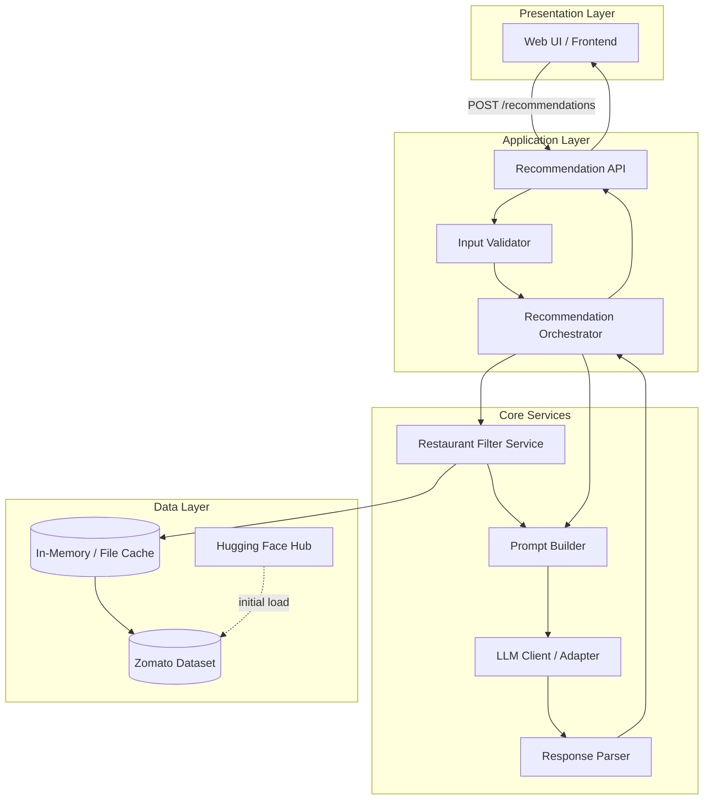
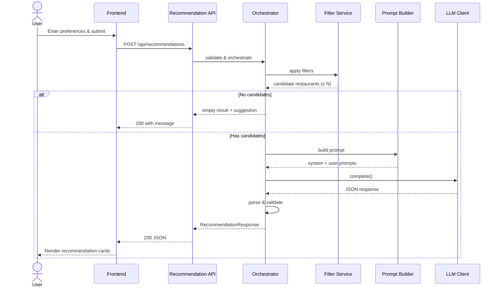

# ZOMATA Milestone AI — System Architecture

> Derived from [`docs/context.md`](./context.md). This document describes the detailed technical architecture for the AI-powered restaurant recommendation system.

---

## Table of Contents

1. [Architecture Overview](#1-architecture-overview)
2. [High-Level System Diagram](#2-high-level-system-diagram)
3. [Layered Architecture](#3-layered-architecture)
4. [Component Design](#4-component-design)
5. [Data Architecture](#5-data-architecture)
6. [Request & Response Flow](#6-request--response-flow)
7. [Filtering & Ranking Strategy](#7-filtering--ranking-strategy)
8. [LLM Integration Design](#8-llm-integration-design)
9. [API Contract](#9-api-contract)
10. [Frontend Architecture](#10-frontend-architecture)
11. [Error Handling & Resilience](#11-error-handling--resilience)
12. [Security Considerations](#12-security-considerations)
13. [Deployment Architecture](#13-deployment-architecture)
14. [Suggested Technology Stack](#14-suggested-technology-stack)
15. [Future Extensions](#15-future-extensions)

---

## 1. Architecture Overview

The system follows a **hybrid recommendation architecture**: structured filtering over a real-world dataset narrows the candidate set, and an LLM performs semantic reasoning, ranking, and natural-language explanation on that subset.

### Design Principles

| Principle | Description |
|-----------|-------------|
| **Separation of concerns** | Data ingestion, filtering, LLM orchestration, and presentation are isolated modules |
| **Deterministic first, AI second** | Hard filters (location, rating, budget) run before LLM calls to reduce cost and hallucination risk |
| **Structured I/O** | LLM receives JSON-serialized restaurant records and returns structured JSON for reliable UI rendering |
| **Fail gracefully** | If the LLM is unavailable, return filtered results with template-based explanations |
| **Single source of truth** | The Hugging Face Zomato dataset is the authoritative restaurant catalog |

### Architectural Style

- **Pattern:** Layered + pipeline (ETL → filter → enrich → LLM → render)
- **Interaction model:** Request/response (synchronous for MVP; async queue optional for scale)
- **Deployment target:** Monolithic backend + static/SPA frontend (simplest path to MVP)

---

## 2. High-Level System Diagram



---

## 3. Layered Architecture

```
┌─────────────────────────────────────────────────────────────┐
│                    PRESENTATION LAYER                        │
│  Preference form · Results cards · Loading/error states      │
└─────────────────────────────┬───────────────────────────────┘
                              │
┌─────────────────────────────▼───────────────────────────────┐
│                    APPLICATION LAYER                         │
│  REST/HTTP endpoints · Validation · Orchestration            │
└─────────────────────────────┬───────────────────────────────┘
                              │
┌─────────────────────────────▼───────────────────────────────┐
│                    INTEGRATION LAYER                         │
│  Filter service · Prompt builder · LLM adapter · Parser    │
└─────────────────────────────┬───────────────────────────────┘
                              │
┌─────────────────────────────▼───────────────────────────────┐
│                       DATA LAYER                             │
│  Dataset loader · Preprocessor · Normalized restaurant store │
└─────────────────────────────────────────────────────────────┘
```

### Layer Responsibilities

| Layer | Responsibility | Does NOT |
|-------|----------------|----------|
| **Presentation** | Collect preferences, render recommendations | Call LLM directly |
| **Application** | Route requests, validate input, coordinate pipeline | Contain business filtering logic |
| **Integration** | Filter data, build prompts, invoke LLM, parse output | Own persistent storage (MVP) |
| **Data** | Load, clean, normalize, cache restaurant records | Make recommendation decisions |

---

## 4. Component Design

### 4.1 Data Ingestion Module

**Purpose:** Load the Zomato dataset from Hugging Face and produce a clean, queryable in-memory catalog.

```
Hugging Face Dataset
        │
        ▼
   Raw Records
        │
        ▼
  Field Extractor ──► name, location, cuisine, cost, rating, metadata
        │
        ▼
  Normalizer ──► consistent types, trimmed strings, parsed cuisines
        │
        ▼
  Budget Mapper ──► map numeric cost → low | medium | high
        │
        ▼
  Cached DataFrame / List[Restaurant]
```

**Key behaviors:**

- Run once at application startup (or on first request with lazy init)
- Log record count, null-field stats, and unique locations/cuisines
- Drop or impute records missing critical fields (`name`, `location`)
- Normalize location strings (case-insensitive, alias handling e.g. "Bengaluru" → "Bangalore")

### 4.2 Input Validator

**Purpose:** Enforce valid, complete user preference payloads before processing.

| Field | Validation Rules |
|-------|------------------|
| `location` | Required, non-empty string; must match known city or fuzzy-match |
| `budget` | Enum: `low` \| `medium` \| `high` |
| `cuisine` | Optional string; partial match allowed |
| `min_rating` | Optional float, range 0.0–5.0 |
| `additional_preferences` | Optional free-text string, max length cap (e.g. 500 chars) |

Returns `400 Bad Request` with field-level errors on failure.

### 4.3 Restaurant Filter Service

**Purpose:** Apply deterministic filters to reduce the candidate pool before LLM invocation.

**Filter pipeline (sequential):**

1. **Location filter** — exact or fuzzy match on city/area
2. **Rating filter** — `rating >= min_rating`
3. **Cuisine filter** — substring or token match on cuisine field
4. **Budget filter** — map restaurant cost to tier, match user budget
5. **Top-N cap** — limit to e.g. 20–50 candidates to fit LLM context window

**Output:** Ordered list of `Restaurant` objects (unordered or sorted by rating as pre-rank).

### 4.4 Prompt Builder

**Purpose:** Construct a system + user prompt pair from filtered restaurants and user preferences.

**Inputs:**

- User preference object
- Filtered restaurant list (serialized JSON)
- Optional: number of recommendations requested (default: 5)

**Outputs:**

- `system_prompt` — role, constraints, output schema
- `user_prompt` — preferences + candidate restaurants

### 4.5 LLM Client / Adapter

**Purpose:** Abstract provider-specific API calls behind a uniform interface.

```python
class LLMClient(Protocol):
    def complete(self, system: str, user: str) -> str: ...
```

**Supported providers (via adapter pattern):**

- Groq (Primary LLM provider)
- Local models via Ollama (development/offline)

**Configuration via environment variables:** `LLM_PROVIDER`, `LLM_API_KEY`, `LLM_MODEL`.

### 4.6 Response Parser

**Purpose:** Parse LLM JSON output into typed recommendation objects; validate against source data.

**Validation rules:**

- Every recommended `restaurant_name` must exist in the filtered candidate set
- Ratings and costs must match source records (LLM must not invent values)
- Fill missing explanations with a fallback template

### 4.7 Recommendation Orchestrator

**Purpose:** Central coordinator that executes the full pipeline.

```
validate(input)
  → filter(preferences)
  → if empty: return "no results" response
  → build_prompt(filtered, preferences)
  → llm.complete(prompt)
  → parse(response)
  → return RecommendationResponse
```

---

## 5. Data Architecture

### 5.1 Source Dataset

| Attribute | Value |
|-----------|-------|
| **Source** | Hugging Face |
| **URL** | https://huggingface.co/datasets/ManikaSaini/zomato-restaurant-recommendation |
| **Format** | Tabular (CSV/Parquet via `datasets` library) |
| **Refresh** | Static for MVP; re-download on deploy or manual trigger |

### 5.2 Canonical Restaurant Schema

```json
{
  "id": "string",
  "name": "string",
  "location": "string",
  "city": "string",
  "cuisine": "string",
  "rating": 4.2,
  "cost_for_two": 800,
  "budget_tier": "medium",
  "address": "string | null",
  "metadata": {}
}
```

### 5.3 Budget Tier Mapping

| Tier | Cost for Two (INR) | Description |
|------|-------------------|-------------|
| `low` | ≤ 500 | Budget-friendly |
| `medium` | 501 – 1500 | Mid-range dining |
| `high` | > 1500 | Premium / fine dining |

> Thresholds are configurable constants; tune after inspecting actual dataset distribution.

### 5.4 Internal Data Models

**UserPreferences**

```json
{
  "location": "Bangalore",
  "budget": "medium",
  "cuisine": "Italian",
  "min_rating": 4.0,
  "additional_preferences": "family-friendly, outdoor seating"
}
```

**Recommendation (output item)**

```json
{
  "rank": 1,
  "name": "Truffles",
  "cuisine": "Continental, Italian",
  "rating": 4.5,
  "estimated_cost": "₹800 for two",
  "explanation": "Great fit for medium budget Italian dining in Bangalore with strong ratings and family-friendly ambiance."
}
```

**RecommendationResponse**

```json
{
  "summary": "Here are 5 Italian restaurants in Bangalore that match your medium budget and 4.0+ rating preference.",
  "recommendations": [ /* Recommendation[] */ ],
  "meta": {
    "candidates_considered": 23,
    "filters_applied": ["location", "cuisine", "budget", "min_rating"]
  }
}
```

---

## 6. Request & Response Flow

### End-to-End Sequence



### Latency Budget (MVP targets)

| Stage | Target |
|-------|--------|
| Input validation | < 10 ms |
| Filtering (in-memory) | < 50 ms |
| LLM call | 1–5 s (provider-dependent) |
| Parse & respond | < 20 ms |
| **Total** | ~1–6 s |

---

## 7. Filtering & Ranking Strategy

### Two-Stage Recommendation Model

```
Stage 1: Deterministic Filtering (code)
   └── Reduces full dataset → manageable candidate set

Stage 2: LLM Ranking & Explanation (AI)
   └── Ranks candidates, writes personalized explanations
```

### Why Not LLM-Only?

| Approach | Pros | Cons |
|----------|------|------|
| **LLM-only** | Flexible | Expensive, slow, hallucination risk |
| **Filter-only** | Fast, accurate | No natural-language explanations |
| **Hybrid (chosen)** | Accurate data + rich explanations | Requires prompt engineering |

### Filter Fallback Behavior

| Scenario | Behavior |
|----------|----------|
| Zero results after all filters | Relax least-critical filter (cuisine first), retry once |
| Still zero results | Return helpful message with suggested alternate locations/cuisines |
| Too many results (> cap) | Sort by rating desc, take top N before LLM |

---

## 8. LLM Integration Design

### 8.1 Prompt Structure

**System prompt (template):**

```
You are a restaurant recommendation assistant for an app inspired by Zomato.
You receive a user's dining preferences and a list of real restaurants from a verified dataset.

Rules:
- ONLY recommend restaurants from the provided candidate list
- Do NOT invent restaurant names, ratings, or prices
- Rank by best overall fit to user preferences
- Write concise, friendly explanations (1-2 sentences each)
- Return valid JSON matching the required schema
```

**User prompt (template):**

```
User preferences:
- Location: {location}
- Budget: {budget}
- Cuisine: {cuisine}
- Minimum rating: {min_rating}
- Additional: {additional_preferences}

Candidate restaurants (JSON):
{filtered_restaurants_json}

Return the top {top_k} recommendations as JSON:
{
  "summary": "...",
  "recommendations": [
    {
      "rank": 1,
      "name": "...",
      "cuisine": "...",
      "rating": 0.0,
      "estimated_cost": "...",
      "explanation": "..."
    }
  ]
}
```

### 8.2 Hallucination Mitigation

1. Pass only filtered candidates — never the full dataset
2. Require JSON output with a fixed schema
3. Post-validate every `name` against the candidate list
4. Overwrite `rating` and `cost` from source data after LLM response
5. Use low temperature (0.2–0.4) for consistent ranking

### 8.3 LLM Failure Fallback

If the LLM call fails (timeout, rate limit, invalid JSON):

1. Return top 5 filtered restaurants sorted by rating
2. Attach template explanation: *"Highly rated {cuisine} option in {location} within your {budget} budget."*
3. Set response flag: `"llm_fallback": true`

---

## 9. API Contract

### `POST /api/recommendations`

**Request body:**

```json
{
  "location": "Delhi",
  "budget": "low",
  "cuisine": "Chinese",
  "min_rating": 3.5,
  "additional_preferences": "quick service",
  "top_k": 5
}
```

**Success response (`200 OK`):**

```json
{
  "summary": "...",
  "recommendations": [ ... ],
  "meta": {
    "candidates_considered": 18,
    "filters_applied": ["location", "cuisine", "budget", "min_rating"],
    "llm_fallback": false
  }
}
```

**Validation error (`400 Bad Request`):**

```json
{
  "error": "validation_error",
  "details": [
    { "field": "budget", "message": "Must be one of: low, medium, high" }
  ]
}
```

**No results (`200 OK`):**

```json
{
  "summary": "No restaurants matched your criteria.",
  "recommendations": [],
  "meta": { "suggestions": ["Try lowering min_rating", "Try nearby city: Noida"] }
}
```

### `GET /api/health`

Returns service status and dataset load info.

```json
{
  "status": "ok",
  "dataset_loaded": true,
  "restaurant_count": 51717
}
```

### `GET /api/metadata`

Returns available filter options for populating UI dropdowns.

```json
{
  "locations": ["Delhi", "Bangalore", "Mumbai"],
  "cuisines": ["Italian", "Chinese", "North Indian"],
  "budgets": ["low", "medium", "high"]
}
```

---

## 10. Frontend Architecture

### Page Structure

```
App
├── PreferenceForm
│   ├── LocationSelect
│   ├── BudgetSelect
│   ├── CuisineInput
│   ├── RatingSlider
│   └── AdditionalPreferencesTextarea
├── LoadingState
├── ErrorBanner
└── ResultsPanel
    ├── SummaryText
    └── RecommendationCard (× N)
        ├── Name & Rank
        ├── Cuisine · Rating · Cost
        └── AI Explanation
```

### UI States

| State | Trigger | Display |
|-------|---------|---------|
| **Idle** | Page load | Empty form, no results |
| **Loading** | Form submit | Spinner + "Finding restaurants..." |
| **Success** | 200 with recommendations | Summary + cards |
| **Empty** | 200 with zero results | Message + suggestions |
| **Error** | 4xx/5xx or network fail | Error banner with retry |

### Frontend ↔ Backend Communication

- Single `fetch`/`axios` call to `POST /api/recommendations`
- Metadata endpoint populates location/cuisine dropdowns on mount
- No direct LLM access from the browser (API key stays server-side)

---

## 11. Error Handling & Resilience

| Error Type | Handling |
|------------|----------|
| Invalid user input | 400 with field errors; UI highlights fields |
| Dataset not loaded | 503; retry after startup completes |
| Zero filter matches | 200 with suggestions, not an error |
| LLM timeout | Fallback to rating-sorted results |
| LLM invalid JSON | Retry once with repair prompt; then fallback |
| Unknown server error | 500 with generic message; log full trace server-side |

### Logging

- Log each recommendation request (preferences, candidate count, latency, LLM fallback flag)
- Do **not** log API keys or full LLM prompts in production

---

## 12. Security Considerations

| Concern | Mitigation |
|---------|------------|
| **API key exposure** | LLM keys stored in server env vars only |
| **Prompt injection** | Sanitize `additional_preferences`; strip control chars; length cap |
| **Rate limiting** | Apply per-IP rate limit on `/api/recommendations` |
| **CORS** | Restrict to frontend origin in production |
| **Input size** | Max body size limit on API gateway |

---

## 13. Deployment Architecture

### MVP (Single Server)

```
┌──────────────────────────────────────┐
│           Application Server        │
│  ┌────────────┐    ┌──────────────┐  │
│  │  FastAPI   │    │ In-memory    │  │
│  │  Backend   │───►│ Dataset Cache│  │
│  └─────┬──────┘    └──────────────┘  │
│        │                              │
│        ▼                              │
│  ┌────────────┐                      │
│  │ LLM API    │ (external)           │
│  └────────────┘                      │
└──────────────────────────────────────┘
         ▲
         │ HTTPS
┌────────┴────────┐
│  Static Frontend │ (Vercel / Netlify / same server)
└─────────────────┘
```

### Environment Variables

| Variable | Purpose |
|----------|---------|
| `LLM_PROVIDER` | `groq` \| `ollama` |
| `LLM_API_KEY` | Provider API key |
| `LLM_MODEL` | Model identifier |
| `DATASET_CACHE_PATH` | Optional local cache path |
| `TOP_K_DEFAULT` | Default number of recommendations |
| `CORS_ORIGINS` | Allowed frontend origins |

### Startup Sequence

1. Load environment config
2. Download/load Hugging Face dataset
3. Preprocess and cache in memory
4. Extract metadata (locations, cuisines) for `/api/metadata`
5. Start HTTP server
6. Health check passes → ready for traffic

---

## 14. Suggested Technology Stack

| Layer | Recommended | Alternatives |
|-------|-------------|--------------|
| **Backend** | Python + FastAPI | Flask, Node.js + Express |
| **Dataset loading** | `datasets`, `pandas` | Polars |
| **LLM SDK** | `groq` | LangChain, LiteLLM |
| **Frontend** | React + Vite | Next.js, plain HTML/JS |
| **Styling** | Tailwind CSS | CSS Modules |
| **Validation** | Pydantic (backend) | Zod (if Node) |
| **Testing** | pytest | unittest |
| **Containerization** | Docker | — |

### Recommended Project Structure

```
ZOMATA-MILESTONE-AI/
├── docs/
│   ├── problemstatement.txt
│   ├── context.md
│   └── architecture.md
├── backend/
│   ├── app/
│   │   ├── main.py              # FastAPI entrypoint
│   │   ├── models/              # Pydantic schemas
│   │   ├── services/
│   │   │   ├── data_loader.py
│   │   │   ├── filter_service.py
│   │   │   ├── prompt_builder.py
│   │   │   ├── llm_client.py
│   │   │   └── orchestrator.py
│   │   └── routes/
│   │       └── recommendations.py
│   ├── tests/
│   └── requirements.txt
├── frontend/
│   ├── src/
│   │   ├── components/
│   │   ├── api/
│   │   └── App.tsx
│   └── package.json
├── .env.example
└── README.md
```

---

## 15. Future Extensions

| Extension | Description |
|-----------|-------------|
| **User accounts** | Save preferences and recommendation history |
| **Vector search** | Embed `additional_preferences` for semantic restaurant matching pre-filter |
| **Caching** | Cache LLM responses for identical preference hashes |
| **Async queue** | Offload LLM calls to a worker for high concurrency |
| **Feedback loop** | Thumbs up/down on recommendations to refine prompts |
| **Multi-city routing** | Geospatial distance filtering beyond city name |
| **A/B prompt testing** | Compare prompt variants for explanation quality |

---

## Appendix: Mapping to Context Requirements

| Context Requirement | Architecture Section |
|---------------------|---------------------|
| Data ingestion from Hugging Face | §4.1, §5.1, §13 |
| User preference collection | §4.2, §10 |
| Integration layer (filter + prompt) | §4.3, §4.4, §7 |
| LLM ranking & explanation | §4.5, §8 |
| Output display | §5.4, §10 |
| Success criteria | §6, §11 (resilience ensures reliability) |

---

*Last updated: derived from `docs/context.md`*
